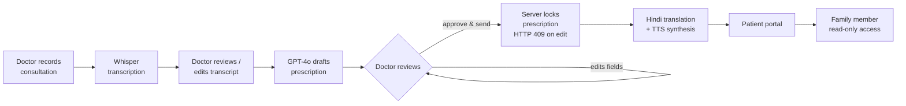

# SehatRx

[](https://github.com/akshita270/sehatrx/actions/workflows/tests.yml)
[](LICENSE)

**Consultations to prescriptions, without the paperwork.**

**[Live demo →](https://sehatrx.vercel.app)** (seeded demo accounts — see [Getting Started](#getting-started))

SehatRx is an AI-assisted consultation and prescription workflow built for Indian
clinics. A doctor records a consultation in Hindi, English, or Hinglish; the app
transcribes it with Whisper, drafts a structured prescription with GPT-4o, and lets
the doctor review and correct it before it ever reaches the patient. Once approved,
it appears instantly — bilingually, with audio playback — in the patient's own portal.

It started as a single build prompt and turned into an iterative product build: most
of the interesting logic in this repo exists because a scripted test conversation
exposed a bug, not because a spec asked for it. See [Engineering Notes](#engineering-notes--things-that-actually-broke)
below for the specifics.

---

## Table of Contents

- [Why This Exists](#why-this-exists)
- [Features](#features)
- [How a Consultation Flows](#how-a-consultation-flows)
- [Tech Stack](#tech-stack)
- [Engineering Notes — Things That Actually Broke](#engineering-notes--things-that-actually-broke)
- [Getting Started](#getting-started)
- [Running Tests](#running-tests)
- [Project Structure](#project-structure)
- [API Overview](#api-overview)
- [Roadmap](#roadmap)

---

## Why This Exists

Indian clinics are high-volume and time-poor. Doctors often write prescriptions by
hand or type them up after the patient has left, in a language the patient may not
read, with no easy way for a patient to later ask "wait, was I supposed to take this
before or after food?" SehatRx tries to close that gap: capture the conversation as
it happens, let AI do the transcription and first-draft paperwork, and put the final,
doctor-approved version directly in front of the patient — in their language, readable
out loud if needed, and impossible to quietly alter after the fact.

## Features

**For doctors**
- Record a consultation and get a Whisper transcript, editable before drafting
- GPT-4o-mini drafts a full structured prescription: chief complaint, diagnosis,
  vitals, medicines (dose/frequency/duration/timing), tests, diet advice, general
  advice — doctor reviews and edits everything before it can be sent
- Once sent, a prescription is **immutable** — enforced server-side, not just hidden
  in the UI (see [Engineering Notes](#engineering-notes--things-that-actually-broke))
- AI flags medicine durations it *inferred* rather than ones the doctor stated
  explicitly, so nothing gets rubber-stamped without a second look
- AI listens for allergy or adverse-drug-reaction mentions anywhere in the
  conversation — even off-topic — and prompts the doctor to save new ones to the
  patient's profile instead of letting them get lost in a one-off transcript
- Known-allergy warning banner shown before prescribing, every time
- Collapsible "Past Visits" panel while drafting — every prior sent prescription for
  this patient, across every doctor who's seen them, so a second visit isn't a blank
  slate: what was tried before, and whether it's worth stepping up treatment
- Dashboard with search/filter, approval-pending items surfaced first, delete for
  abandoned (never-sent) consultations, print/PDF export
- Recording length (10 min) and audio size (20 MB) caps to keep Whisper costs bounded;
  AI endpoints rate-limited at 20 requests/hour

**For patients**
- Portal showing every prescription ever sent, in English or Hindi
- One-click PDF download, server-rendered (WeasyPrint) so Hindi text shapes correctly
  — not a browser print dialog
- "Listen to this prescription" — a synthesized, cached audio summary for patients
  who can't or don't want to read
- Larger-text mode for older or low-vision patients
- Grant read-only access to a family member ("Family Access") without sharing a login
- Editable known-allergies field patients can keep current themselves

**For family / caregivers**
- Claim access to a linked patient's prescriptions using the same login-claim pattern
  as walk-in patient accounts — no separate invite flow to build or maintain

**Everywhere**
- Full app chrome (not just prescription content) toggles between English and Hindi
- Toast confirmations for the actions that used to fail silently
- 27 automated backend tests, all mocking the OpenAI calls — the suite costs nothing
  to run and never touches a real API key

## How a Consultation Flows



## Tech Stack

| Layer | Choice |
|---|---|
| Backend | FastAPI, SQLAlchemy 2.0, Alembic migrations, Pydantic v2 |
| Database | PostgreSQL (separate `sehatrx_test` DB for the test suite) |
| Auth | JWT (python-jose) + bcrypt password hashing, three roles: doctor / patient / caregiver |
| AI | OpenAI Whisper (`whisper-1`) for transcription, GPT-4o-mini with strict JSON-schema structured outputs for drafting/translation, `tts-1` for speech |
| Rate limiting | slowapi, 20 req/hour on the paid AI endpoints |
| Frontend | React 18 + Vite, React Router, no CSS framework — inline style objects + a small shared theme |
| Icons | lucide-react |
| Testing | pytest + httpx, fully mocked AI calls, transactional per-test DB rollback |

## Engineering Notes — Things That Actually Broke

A portfolio README that only lists features misses the point of building something
end-to-end. These are the bugs and design problems that came from actually using the
app with realistic Hindi/Hinglish test conversations, not from a spec:

- **A doctor could tamper with a sent prescription via direct API calls.** The UI hid
  the edit form after sending, but nothing stopped a PATCH request from changing a
  prescription a patient had already seen. Fixed by making the *server* the
  authority: `update_prescription` and `approve_consultation` both check
  `consultation.status == sent` and return `409 Conflict`, verified with a
  regression test that tampers via a raw request, not the UI.

- **The AI silently flipped a negative into a positive.** A doctor said "फास्टिंग
  जरूरी नहीं है" (fasting is *not* required) and the drafted prescription said
  "fasting required" — the negation got dropped in translation. Fixed by adding
  explicit negation-handling instructions to the drafting prompt, with the exact
  failing example baked in as a worked case, and re-verified against the same test
  transcript.

- **The AI's medicine-timing field was structurally incapable of saying "between 12
  and 1 PM."** The JSON schema locked `timing` to a five-value enum built for
  standard phrases like "After Food." A doctor giving a specific clock time had no
  way to be captured. Fixed by relaxing the schema and later **splitting timing into
  two independent fields** (`timing` = relation to food, `timingWhen` = time of day),
  because doctors routinely give both in the same sentence ("subah khaali pet") and
  cramming two facts into one string meant one of them silently got dropped.

- **"If no relief in 3 days, come back" quietly vanished as medicine duration.**
  Indian doctors very often state a medicine's duration *indirectly*, as a follow-up
  window, rather than "take this for 3 days." Extracting duration too literally left
  it blank; guessing it for every medicine risked inventing days a doctor never said.
  The fix distinguishes explicit vs. inferred duration, and the UI shows a small
  "AI inferred this" marker on inferred durations so the doctor knows exactly what to
  double-check before approving — instead of silently trusting either extreme.

- **"None on file" and "nobody asked" looked identical.** The known-allergies field
  was only ever populated by a human typing it into a form. If a patient mentioned an
  allergy mid-conversation and the doctor forgot to go update the profile afterward,
  the app had no way to know the difference between "confirmed no allergies" and
  "we just never asked." The fix has the AI listen for allergy mentions during
  drafting and surface a one-click "save to profile" prompt at the moment it's
  cheapest to act on — while the doctor is already looking at the draft.

- **Knowing a patient's email was enough to steal their account** — and, worse,
  Indian clinics routinely see elderly patients with no email at all, which the app
  couldn't handle. Walk-in patients (and invited family caregivers) start as an
  unclaimed record until they self-register with matching credentials. First fix was
  a single-use claim code the doctor hands over in person, required alongside the
  email to register. That closed the takeover hole but broke the common case: a
  patient with no email couldn't be added at all, and testing surfaced a second bug —
  the same person ended up as two disconnected database rows (one from the doctor's
  walk-in entry, one from a later self-registration) with no link between them, so
  their sent prescription was invisible from their own portal login.
  The claim code was removed in favor of a different tradeoff: patients can now be
  identified by phone *or* email (either one, not both), and adding a patient looks
  up existing records by whichever identifier is given so the same person is reused
  instead of duplicated. Self-registration links to that record directly, with no
  separate proof-of-identity step. For a real clinic handling real patient data, that
  step (claim code, or an SMS OTP) would need to come back — but it requires a paid
  SMS/email provider to do properly, and this project has no real patients to
  protect, so the simpler flow won for now. Noted here rather than silently dropped.

- **The "locked" prescription had an unlocked door right next to it.** Sending a
  prescription correctly blocks further edits to the prescription itself
  (`update_prescription`/`approve_consultation` both check `status == sent`) - but
  `update_transcript` had no such check. The actual record of what was said during
  the consultation could still be silently rewritten after the (locked) prescription
  had already gone to the patient, which defeats the point of locking anything.
  Fixed with the same check, copied from the endpoints that already had it.

- **Deleting a consultation left zero trace it ever happened.** Never-sent
  consultations can be deleted (sent ones can't, for patient-safety reasons), but the
  delete was a plain hard delete - a doctor could record something, decide they
  didn't like what was in the transcript, delete it, and there'd be no record the
  consultation had ever existed. Added an append-only `consultation_deletion_logs`
  table - written *before* the delete, in the same transaction - capturing who
  deleted what, when, and a summary of what was lost (had a transcript? had a draft
  prescription? what status was it in?). It doesn't restore anything, and there's no
  admin UI to browse it yet since the app has no admin role - but the action itself
  can no longer disappear without a trace.

- **The AI-cost rate limit was keyed by IP, not by who was actually using it.**
  `slowapi`'s default key function is the caller's IP address. Two real problems:
  every doctor on the same clinic WiFi shared one 20/hour bucket - one busy doctor
  could lock out their colleagues - and it was trivially bypassed by switching
  networks. Every endpoint it guards already requires a bearer token, so the fix
  decodes the JWT directly in the key function (before FastAPI's normal dependency
  injection has even run) and keys on the doctor's user ID instead, falling back to
  IP only if there's no valid token. Verified two different users' tokens produce
  different keys even when the request comes from the identical IP.

## Getting Started

### Prerequisites

- Python 3.11 (3.14 is too new for some pinned deps as of this writing)
- Node.js 18+
- Docker (for local Postgres)
- An OpenAI API key with access to Whisper, GPT-4o, and TTS
- Pango (system library, for PDF generation): `brew install pango` on macOS, or
  `apt-get install libpango-1.0-0 libpangocairo-1.0-0` on Debian/Ubuntu

### 1. Start Postgres

```bash
cd backend
cp .env.example .env   # then fill in OPENAI_API_KEY
docker compose up -d
```

### 2. Backend

```bash
cd backend
python3.11 -m venv venv
source venv/bin/activate
pip install -r requirements.txt
alembic upgrade head
uvicorn app.main:app --reload --port 8000
```

Demo accounts are seeded automatically on startup:

| Role | Login |
|---|---|
| Doctor | `doctor@demo.com` / `demo123` |
| Patient | `patient@demo.com` / `demo123` (also `sunita@demo.com`, `aman@demo.com`) |

### 3. Frontend

```bash
cd frontend
cp .env.example .env
npm install
npm run dev
```

Open **http://localhost:5173**.

> `OPENAI_API_KEY` must be set for real transcription (`/transcribe`) and
> prescription drafting (`/draft-rx`) to work. Without it, those two AI endpoints
> return a clear, retryable error in the UI — everything else in the app (dashboards,
> patient portal, editing, print, etc.) works without a key.
>
> Recording requires a real browser with microphone access (`MediaRecorder` +
> `getUserMedia`) — it won't work in a sandboxed/headless preview.

## Running Tests

```bash
cd backend
source venv/bin/activate
python -m pytest tests/ -v
```

27 tests, all passing, all free to run:

- Every OpenAI call (Whisper, GPT-4o drafting, translation) is mocked with
  `monkeypatch` — no API key or network access needed
- Each test runs in its own DB transaction against a separate `sehatrx_test`
  database (auto-created), rolled back afterward — your dev data is never touched
- Includes regression tests for the immutability fix (tamper attempts return 409),
  the allergy-flagging logic (new vs. already-known), and oversized-audio rejection

## Project Structure

```
backend/
  app/
    models.py            SQLAlchemy models
    schemas.py            Pydantic request/response schemas
    routers/               auth, patients, consultations, prescriptions, caregivers
    services/
      openai_client.py     Whisper / GPT-4o drafting & translation / TTS, all prompts
      speech_script.py     builds the spoken-summary text for TTS, reusing translated fields
  alembic/versions/        migrations
  tests/                    pytest suite (mocked AI, transactional DB)
frontend/
  src/
    pages/                  AuthPage, DoctorDashboard, ConsultationPage, PatientPortal, CaregiverPortal
    components/             shared UI: Card, Button, Badge, Field, modals, AudioPlayButton, Waveform
    i18n.js                 UI-chrome translation strings (English/Hindi)
    ToastContext.jsx        toast notification system
```

## API Overview

All endpoints are JWT-authenticated except `/auth/*`. A non-exhaustive map:

| Area | Endpoints |
|---|---|
| Auth | `POST /auth/register/{doctor,patient,caregiver}`, `POST /auth/login`, `GET /auth/me`, `PATCH /auth/me` |
| Patients | `GET/POST /patients`, `PATCH /patients/{id}/allergies` |
| Consultations | `POST /consultations`, `PATCH /consultations/{id}/transcript`, `POST /consultations/{id}/transcribe`, `POST /consultations/{id}/draft-rx`, `PATCH /consultations/{id}/prescription`, `POST /consultations/{id}/approve`, `DELETE /consultations/{id}` |
| Prescriptions (patient) | `GET /patients/me/prescriptions`, `GET /patients/me/prescriptions/{id}`, `GET /patients/me/prescriptions/{id}/audio` |
| Caregivers | `GET/POST /patients/me/caregivers`, `DELETE /patients/me/caregivers/{id}`, `GET /caregiver/patients`, `GET /caregiver/patients/{id}/prescriptions` |

## Roadmap

Not built yet, deliberately — these need real reference data or a design decision,
not just more prompt engineering:

- **Drug–drug interaction checks** (e.g. warfarin + amoxicillin) and **dose-range
  validation** against a curated reference table, not an LLM's own unverified opinion
  on drug safety
- Broader regional-language support beyond Hindi (Whisper and GPT-4o already handle
  most Indian languages; the app-side plumbing would need generalizing from a
  hardcoded `en`/`hi` pair to a per-patient language preference)
- No password-reset flow for any role yet — a locked-out doctor/patient/caregiver
  currently has no self-service recovery path
